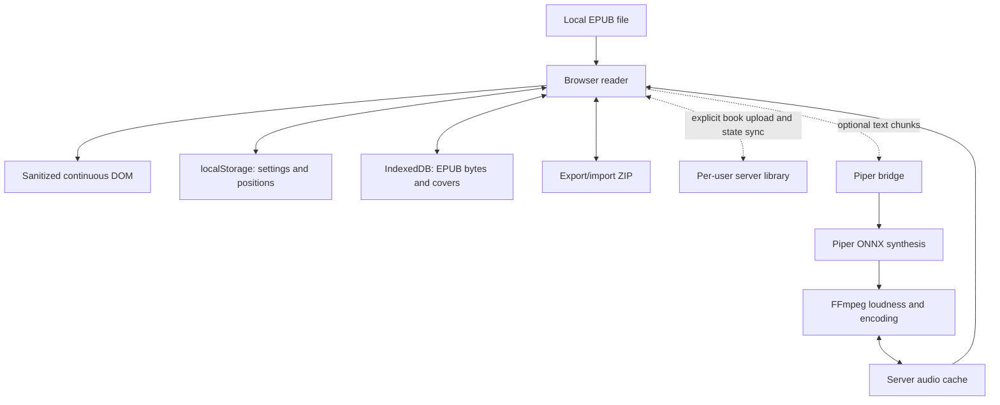
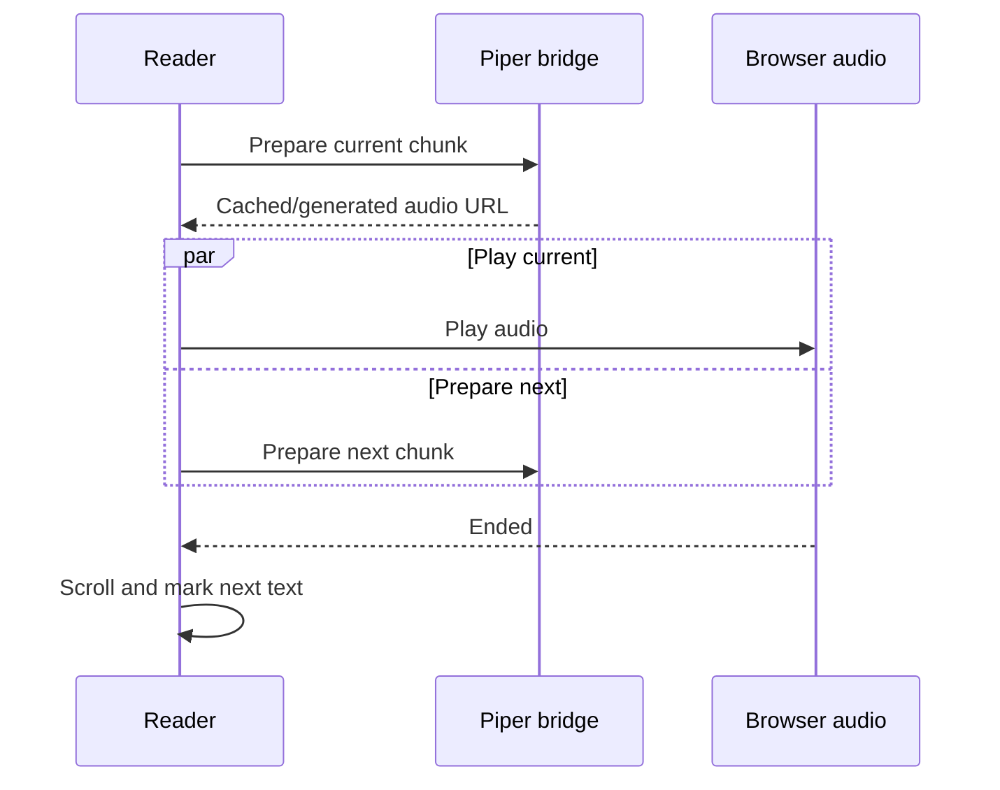

# How Smooth Reader works

This document describes the technical design of Smooth Reader V36. It is meant
for people who want to understand, modify, debug, or deploy the application.

## Design goals

Smooth Reader deliberately uses a small, conventional web stack:

- no Electron, framework, bundler, npm install, or compilation step
- a continuous browser document with native scrolling
- local-first EPUB handling and persistence
- optional Piper text-to-speech and per-user server libraries through a small
  Python bridge
- the same static reader on desktop, mobile, GitHub Pages, or a private server

The reader itself is HTML, CSS, and plain JavaScript. EPUB.js and JSZip are
vendored browser libraries. Fonts are also bundled locally. The Python bridge
is optional: without it, local reading, storage, and ZIP backup still work.

## Project layout

| File or directory | Responsibility |
| --- | --- |
| `index.html` | Home screen, reader shell, settings drawer, overlays, file inputs, and Content Security Policy |
| `renderer-v36.js` | EPUB loading, DOM rendering, navigation, persistence, backup/import, interaction, and speech client |
| `styles-v36-mobile7.css` | Palettes, reader layout, responsive rules, menus, overlays, and speech marker |
| `vendor/epub.min.js` | EPUB archive/package/spine handling through EPUB.js |
| `vendor/jszip.min.js` | ZIP support used by EPUB.js and library export/import |
| `vendor/fonts/` | Self-hosted reading fonts and EnvyCodeR Nerd Font for the interface |
| `piper_bridge.py` | Static HTTP server, Piper/FFmpeg speech API, audio cache, and per-user server library |
| `serve` | Minimal executable wrapper that forwards environment variables and command-line options to the bridge |
| `SERVER-INSTALL.md` | Debian, systemd, Nginx, TLS, and Basic Authentication deployment guide |
| `test/` | Browser-logic smoke tests, real EPUB ZIP test, and Piper bridge integration test |

## Runtime architecture



The EPUB file is uploaded only when the user explicitly chooses `STORE ON
SERVER`. After that initial transfer, normal synchronization sends only small
position/settings records. When Piper is enabled, spoken text chunks are also
sent to the bridge.

## EPUB loading and rendering

### 1. File acquisition

An EPUB can arrive from the file picker, drag and drop, or the browser-side
cache. The app accepts the first dropped file whose name ends in `.epub` and
reads it as an `ArrayBuffer`.

Before replacing the currently loaded book, JSZip verifies that the input is a
readable ZIP containing `META-INF/container.xml` and a package-document path.
Archive validation, EPUB.js opening, individual section rendering, and metadata
loading each have a 30-second bound. A rejection or timeout clears the loading
lock and displays the underlying EPUB error instead of leaving `OPENING` or
`LOADING` visible indefinitely. Validation runs before replacing the current
book, so a damaged file does not close a book that was already open.

### 2. Stable book identity

The complete EPUB byte array is hashed with SHA-256 through Web Crypto. This
content hash is the primary book identifier and is used in position and
per-book-settings keys. Renaming an unchanged file therefore does not lose its
state. File name matching remains only as a compatibility fallback for older
records without a hash.

### 3. EPUB parsing

`ePub(bytes)` opens the archive. After EPUB.js reports `opened` and `ready`, the
app enumerates the spine in reading order. Every spine section is rendered in
sequence with EPUB.js, parsed through `DOMParser`, and appended to `#viewer` as
a `.book-section`.

Unlike a paginated EPUB viewer, Smooth Reader does not keep one chapter in an
iframe. It places the complete spine into one ordinary document. That is what
allows native wheel, touch, middle-click, Home, End, Page Up, Page Down, and
browser scrolling to behave consistently across chapter boundaries.

The tradeoff is memory: very large books, image-heavy books, or books with many
chapters produce a correspondingly large DOM.

### 4. Content cleanup

Before EPUB markup enters the page, the app removes:

- scripts, iframes, objects, embeds, forms, form controls, external style
  elements, links, and base elements
- inline event handlers and `srcdoc`
- inline styles, legacy color attributes, and hidden/ARIA-hidden attributes
- `javascript:` URLs

External HTTP(S) links are marked to open in a new tab with
`noopener noreferrer`. The page also has a restrictive Content Security Policy.
Removing publisher styles is intentional: the reader's typography and palette
must remain in control. It also reduces the attack surface, though this is a
small personal reader rather than a general-purpose HTML security sandbox.

### 5. Internal links

Each rendered section records its normalized EPUB path. Relative chapter links
are resolved against that path and looked up in a map. A fragment is matched
against an element's `id` or legacy `name`, then scrolled into view. Absolute
links are left to normal browser navigation.

### 6. Cover thumbnails

Cover extraction runs while the spine and metadata load. EPUB.js supplies a
cover URL, the browser decodes it with `createImageBitmap`, and a canvas scales
it to at most 600 x 900 pixels. The result is a JPEG data URL at quality 0.86
with high-quality canvas resampling. Old cached books can have thumbnails
backfilled when their thumbnail version changes.

## Reader layout and typography

The interface and the book deliberately use separate font variables:

- `--ui-font` is EnvyCodeR Nerd Font and controls the home screen and settings
  drawer.
- `--reader-font` controls the book, reading percentage, and voice label.

Book settings are applied as CSS custom properties on the root element. Font
choice and palette choice are represented by `data-font` and `data-palette`
attributes. The CSS maps those attributes to actual font stacks and color
variables.

Text width is expressed in `ch`, so it is an approximate character count rather
than a fixed pixel width. The actual characters per line vary with the selected
font because proportional glyphs have different widths.

The contrast control derives display colors from the selected palette with CSS
`color-mix()`. Positive values pull foregrounds toward the palette's contrast
foreground and backgrounds toward its contrast background. Negative values
soften foregrounds toward the background.

Responsive rules use both a 620-pixel breakpoint and coarse-pointer detection.
They enlarge touch targets and menu text while scaling the book font for small
screens. Browser zoom remains independent of the app's font-size control.

## Preserving the visible text during reflow

Changing font, size, line height, letter spacing, width, or browser dimensions
causes text to reflow. A fixed `scrollY` would then point to different content.

Before a controlled layout change, the app scans downward from the top edge and
captures a text/caret anchor on the first fully visible line. After fonts and
layout settle, it finds that anchor again and corrects the scroll position by
the anchor's vertical displacement. Resize events use a stable version of the
same anchor until resizing stops. This does not freeze layout; it keeps the
first readable line stable while layout changes around it.

## Navigation and scroll behavior

The home and reader screens are two application states in one page. Opening a
book pushes a `reader` entry into the History API. Returning home uses browser
Back when possible, so Back means home and Forward can return to the still
loaded reader DOM.

Before the reader is hidden, its position is saved and its current scroll offset
is retained in memory. Home is explicitly scrolled to the top. Returning to the
reader restores its prior scroll offset.

Normal scrolling is browser-native. Right-button drag uses Pointer Events and
pointer capture so it continues when the pointer leaves the original text node.
Movement is accumulated and flushed once per animation frame. The current speed
multiplier is `RIGHT_DRAG_SPEED = 1.35`.

Reading percentage is calculated as:

```text
round(scrollY / (document scroll height - viewport height) * 100)
```

It is therefore geometric progress through the rendered document, not a word,
page, or EPUB-location percentage.

## Browser-side persistence

Smooth Reader uses three browser storage mechanisms because they suit different
data sizes and lifetimes.

### localStorage

Small, synchronous state is kept under keys beginning with `smooth-reader:`.

| Key pattern | Stored value |
| --- | --- |
| `smooth-reader:position:<SHA-256>` | JSON containing a chapter/text anchor, `scrollY`, fallback `ratio`, and `savedAt` timestamp |
| `smooth-reader:book-settings:<SHA-256>` | Palette, contrast, typography, width, Piper voice/speaker, maximum speech chunk, spoken-text offset, playback speed, and `savedAt` timestamp |
| `smooth-reader:recent-books` | Up to 12 lightweight book metadata records |
| `smooth-reader:last-book` | Most recently opened book metadata |
| `smooth-reader:palette` | Legacy palette fallback used when opening an older saved book |
| `smooth-reader:contrast` | Legacy/default contrast fallback |
| `smooth-reader:speech-maximum` | Legacy/default maximum TTS chunk fallback |
| `smooth-reader:speech-center-offset` | Legacy/default spoken-text offset fallback |
| `smooth-reader:speech-speed` | Legacy/default browser playback-speed fallback |

The standalone setting keys are retained only as migration fallbacks for older
saved records. A book without a per-book record starts from the first-run
defaults rather than copying the previously opened book. Once active, every
adjustable reader value is written to its per-book record. Older partial records
are upgraded in place the next time their book opens. The home view ignores book
appearance and is always rendered in Nord with neutral contrast.

Position writes are debounced by 180 ms while scrolling. A position is also
saved before hiding or replacing the current book. The saved anchor records the
spine index and character offset on the first fully visible line. Restoration
waits for fonts, images, and two animation frames, then places that line near
the top with a small safety margin. `scrollY`, ratio, and an older percentage
field are fallbacks. Existing 32%-position anchors remain compatible and are
replaced by the first-line form after the next position save. This makes a
server position substantially more stable across desktop/mobile reflow.

### IndexedDB

Large binary data does not fit localStorage reliably. IndexedDB database
`smooth-reader-library`, object store `books`, record `recent-books` contains an
array of up to 12 cached records. Each can include:

- original EPUB bytes as an `ArrayBuffer`
- the generated cover thumbnail data URL
- hash, file name, title, opening timestamp, and thumbnail version

This cache makes recent-book covers clickable and allows reopening without
asking the user to select the original file again. If IndexedDB is unavailable
or a write fails, the metadata and positions can still exist, but the book must
be dropped again.

Home-screen library management uses a temporary selection set. `REMOVE FROM
THIS DEVICE` rewrites the IndexedDB recent-books array, removes the selected
hashes' position and settings keys from localStorage, and updates the last-book
pointer while retaining any server copy. If the currently loaded book is
removed locally, its hidden DOM and active identity are also discarded so
Browser Forward cannot silently restore it.

### sessionStorage

Each browser tab keeps a speech session identifier in session storage. It is
sent with Piper prepare and stop requests so cancellation from one tab does not
cancel other users or tabs.

Browser storage is scoped to the site's origin. HTTP and HTTPS, different
domains, and different ports have separate storage. Private-browsing storage may
be temporary, and clearing site data removes the library.

## Library export and import

Export and import are intentionally available only on the home screen.

### ZIP format

An export named `smooth-reader-library-YYYY-MM-DD.zip` contains:

```text
manifest.json
books/01-<hash-prefix>.epub
books/02-<hash-prefix>.epub
...
```

The manifest currently has format name `smooth-reader-library` and version `1`.
It contains the export timestamp, every string-valued localStorage item in the
`smooth-reader:` namespace, and metadata for each cached book. Cover thumbnails
are carried in that metadata; EPUB bytes are separate ZIP entries. EPUB entries
use ZIP `STORE` because EPUB files are already ZIP archives. The manifest uses
normal deflate compression.

Calling export first saves the current readable position when a book is active.
In normal use the button is on home, and the transition to home has already
saved that position.

### Merge rules

Import does not clear the current browser library.

- Books match by content hash, with file name as a legacy fallback.
- Existing cached EPUB bytes and thumbnails win for duplicate books.
- The newer `openedAt` timestamp is retained.
- Position conflicts use the newer `savedAt` timestamp.
- Imported settings replace same-named local settings.
- The current browser's last-book record is preserved if it already exists.
- The combined collection is sorted by `openedAt` and limited to the newest 12.
- Imported EPUB data is limited to 512 MiB after decompression.

The import is browser-side. It does not import or change Piper voices and does
not include the server audio cache.

## Per-user server library

The browser probes `GET /api/library/books` during startup. A successful reply
enables the server actions and merges server summaries into the home grid. A
server-stored book has a subtle inset outline. When the API is absent, as on
GitHub Pages or the basic `python -m http.server`, server controls stay hidden
and all local features remain unchanged.

`STORE ON SERVER` sends a selected cached EPUB once, followed by its JPEG cover
and JSON state. Upload requests have a three-minute client bound. The bridge
streams EPUB bytes to a temporary file, checks the declared size and SHA-256,
validates the ZIP and EPUB container, then atomically renames it. A partial,
damaged, mismatched, or oversized upload never replaces the stored book.

After storage, local position and settings writes schedule a state-only update
after 1.5 seconds. Hiding or leaving the page also sends a small keepalive
update. The server merges position and settings independently by their
`savedAt` timestamps, preventing an older write for one field from overwriting
a newer value for that field. Opening a server book merges the newest state,
downloads the EPUB only when it is absent from IndexedDB, and then follows the
normal validated opening path.

The on-disk shape beneath `--library-dir` is:

```text
<sha256-of-authenticated-username>/<book-sha256>/
├── book.epub
├── cover.jpg
└── state.json
```

The raw username is not used as a path. With `--require-library-user`, requests
without `X-Smooth-Reader-User` are rejected. Production Nginx must overwrite
that header with `$remote_user`; because the bridge listens only on loopback,
clients cannot bypass Nginx and choose another namespace. Without the flag, a
direct local bridge uses the `local` namespace for convenient personal use.

## Piper text-to-speech: browser side

The reader probes `/api/piper/status` during startup. If the endpoint reports a
working Piper binary, FFmpeg, and at least one voice, speech controls become
available. The browser asks for Opus when it reports support for
`audio/ogg; codecs="opus"`; otherwise it requests WAV.

### Selecting text to read

If the user has selected text, that selection is read. Otherwise the client:

1. examines paragraph, list-item, blockquote, and heading elements;
2. maps normalized text offsets back to DOM text-node offsets;
3. uses DOM ranges to measure individual words;
4. keeps only words fully inside the viewport, excluding an 8-pixel edge;
5. stops at the last visible sentence ending when possible.

This prevents half-visible lines and text below large images from being spoken
before it appears. If a tab becomes hidden during playback, visual verification
is skipped and planned scrolls happen immediately instead of waiting for an
animation. The browser or mobile operating system can still throttle or suspend
a background tab.

### Chunking

The internal minimum is 150 characters. The default maximum is 550 characters
and the menu permits 300 to 1200.

Within the minimum/maximum window, the splitter prefers the latest strong stop
(`.`, `!`, or `?`), then a soft stop (`,`, `;`, or `:`), then whitespace. An
unbroken token is hard-cut at the maximum. For viewport reading, a short final
chunk is held back when an earlier chunk exists so it can be combined with the
next viewport; a short chunk is still allowed when it is the only visible text.

### Look-ahead generation and playback



While one chunk plays, the next chunk is requested. At the end of a visible
batch, the client geometrically plans the next viewport before scrolling and can
start generating its first chunk in advance. Playback never waits for the
10 ms scroll animation; generation and scrolling are separate concerns.

The active text is represented by a DOM `Range`. A narrow marker is positioned
to the left of the owning block and recalculated after scroll, zoom, resize, or
layout changes. Spoken text is centered in the usable viewport with a per-book
-25% to +25% offset. The centering calculation clamps itself so a chunk that can
fit is not intentionally pushed beyond the viewport.

Pause and resume operate directly on the browser `<audio>` element. Background
generation may continue while paused. Stop invalidates the client generation,
releases audio, clears visual state, and sends the tab's session ID to the
bridge.

Per-book speech speed uses the browser audio element's `playbackRate`, from
0.67× to 1.33×, with pitch preservation requested. It therefore changes
immediately without running FFmpeg again or creating another cached audio file.

## Piper bridge: server side

`piper_bridge.py` uses Python's `ThreadingHTTPServer`. It serves the static app
and implements these endpoints:

| Method and path | Purpose |
| --- | --- |
| `GET /api/piper/status` | Piper/FFmpeg availability, voices, speaker counts/names, paths, queue state, and codec details |
| `POST /api/piper/prepare` | Generate or retrieve one speech chunk, optionally with a fixed speaker ID |
| `POST /api/piper/stop` | Cancel queued or active generation for one session |
| `GET /api/piper/audio/<cache-id>` | Stream cached Opus/WAV with HTTP Range support |
| `GET /api/library/status` | Server-library availability, authenticated username, book count, and size limit |
| `GET /api/library/books` | List the authenticated user's server-stored books |
| `PUT /api/library/books/<hash>/epub` | Stream, hash-check, validate, and atomically store one EPUB |
| `PUT /api/library/books/<hash>/cover` | Store its generated JPEG thumbnail |
| `GET /api/library/books/<hash>/state` / `PUT /api/library/books/<hash>/state` | Load or merge position, settings, and metadata |
| `GET /api/library/books/<hash>/epub` | Download the EPUB to another device |
| `GET /api/library/books/<hash>/cover` | Display the server cover on the home screen |
| `DELETE /api/library/books/<hash>` | Remove the authenticated user's server copy and state |

`/api/piper/speak` is retained as an alias for prepare. Piper JSON request
bodies are limited to 32,000 bytes, library state to 512,000 bytes, covers to
2 MiB, and speech text to 8,000 characters. Book, session, and cache IDs are
validated against restricted character patterns.

The bridge binds only to `127.0.0.1`. For a network or Internet deployment,
Nginx should terminate HTTPS, apply authentication, and reverse-proxy to it.

### Voice discovery and selection

The configured voice directory is searched recursively for `.onnx` files.
Voice IDs are paths relative to that root, which allows organized subfolders and
avoids collisions between same-named models.

The matching `<model>.onnx.json` supplies sample rate, speaker count, and—when
present—`speaker_id_map` names. Missing or invalid configuration falls back to
one speaker at 22,050 Hz. The status response keeps the simple voice-ID list for
compatibility and also supplies a `voiceDetails` list used to build the embedded
speaker selector. Speaker options are created only for the explicitly selected
model, so models with more than 900 IDs do not fill every voice menu in advance.

A specifically selected voice is used directly. `RANDOM VOICE` is deterministic:
a hash of the text selects a model. For a multi-speaker model, `RANDOM ID` uses a
hash of voice plus text, so its ID may vary between chunks but identical input
uses the same ID and cache entry. Selecting a numbered ID sends that exact ID on
every prepare request and fixes it for that book. The server validates the ID
against the model's speaker count before running Piper. Single-speaker models
hide the extra selector. The active speaker ID is displayed beside the voice
name only when the model contains multiple speakers.

### Audio-generation pipeline

For an uncached request, the bridge:

1. runs Piper with the selected ONNX model and speaker;
2. validates Piper's temporary PCM WAV;
3. runs FFmpeg with `loudnorm=I=-16:LRA=11:TP=-1.5` and mono output;
4. encodes Ogg Opus at 48 kbps VBR, 48 kHz, `application=voip`, or writes a
   normalized PCM WAV at the model's sample rate;
5. validates the final file;
6. atomically moves audio and JSON metadata into the cache.

Both 22.05 kHz and 48 kHz Piper models work. Opus output is always resampled to
48 kHz; WAV fallback preserves Piper's actual sample rate.

### Cache identity and pruning

The cache ID is SHA-256 over:

- normalized chunk text
- cache-format version
- voice ID plus model file size and modification time
- resolved speaker ID and model sample rate
- requested output format and Opus bitrate

Changing the model, text, speaker, codec, bitrate, or cache version creates a new
entry. Audio is accompanied by a small JSON metadata file. Serving an entry
touches its modification time. After new generation, the oldest audio entries
are pruned until the configured cache size is respected; the default is 1 GiB.

Audio responses support byte ranges and use a long-lived private immutable
cache header. Static app files use `no-store` to avoid stale HTML/JavaScript/CSS,
while versioned bundled fonts are cached as public immutable assets.

### Multi-user behavior

HTTP requests can run in separate threads, but uncached Piper generation is
intentionally serialized through one fair queue. This prevents several heavy
ONNX processes from exhausting a small server. Cached audio bypasses generation
and can be served concurrently. Each session has a cancellation version and an
associated active process, so stopping one reader removes or terminates only its
work.

The audio cache is shared across users. Identical text, voice, speaker, and
format can reuse the same audio without another synthesis. Server EPUB
libraries are isolated by the authenticated Nginx username instead: using the
same login on multiple devices shares books and state, while different logins
resolve to different hashed directories. The bridge has no passwords of its
own; access control belongs in Nginx.

## Browser and server data boundaries

| Data | Location | Sent to server? | Included in export? |
| --- | --- | --- | --- |
| EPUB bytes | Browser IndexedDB; optional per-user server library | Only after `STORE ON SERVER` | Yes, when locally cached |
| Cover thumbnails | Browser IndexedDB; optional per-user server library | With an explicitly stored book | Yes, when locally cached |
| Reading positions | Browser localStorage; optional server `state.json` | After its book is server-stored | Yes |
| Per-book settings and legacy fallbacks | Browser localStorage; optional server `state.json` | After its book is server-stored | Yes |
| Speech session ID | Browser sessionStorage | With speech requests | No |
| Current speech text | Browser memory | Only when Piper is used | No |
| Voice models | Server filesystem | Already server-side | No |
| Generated Opus/WAV | Server cache and browser HTTP cache | Returned to browser | No |

## Failure behavior and limitations

- A static host such as GitHub Pages supports reading but not local Piper API
  calls unless it is served behind the bridge.
- If IndexedDB quota is exhausted, recent metadata can remain but reopening may
  require dropping the EPUB again.
- The persistent text anchor is preferred, with pixel and ratio fallbacks.
  Heavily altered EPUB content can still make restoration approximate.
- Two devices actively reading the same book use field-level last-update-wins
  synchronization rather than collaborative locking.
- Full-book DOM rendering favors scrolling simplicity over minimum memory use.
- Publisher CSS and interactive EPUB content are intentionally discarded.
- Browser autoplay rules require speech audio to be unlocked from a user action.
- Mobile browsers may suspend audio, JavaScript, or networking in the background
  despite the app's hidden-tab handling.
- The Piper queue protects CPU but means several uncached users may wait for one
  another. Previously cached chunks remain fast.

## Running and verification

For the reader without speech:

```sh
python3 -m http.server 8000
```

For the reader with Piper:

```sh
PIPER_BIN=/path/to/piper \
FFMPEG_BIN=/usr/bin/ffmpeg \
python3 piper_bridge.py \
  --voice-dir /path/to/voices \
  --cache-dir /path/to/audio-cache \
  --library-dir /path/to/server-library \
  --port 8000
```

The complete verification suite is:

```sh
make check
```

It performs:

- JavaScript syntax validation
- a DOM/browser-logic smoke test for rendering, controls, storage, chunking,
  visibility, layout anchoring, and export/import rules
- a real EPUB archive test against the vendored JSZip build
- Python bytecode compilation
- a bridge integration test covering multi-session Piper cancellation, audio
  caching/delivery, per-user library isolation, EPUB upload validation, state
  conflict merging, server download/removal, HTTP ranges, and font serving

For production deployment details, continue with [SERVER-INSTALL.md](SERVER-INSTALL.md).
